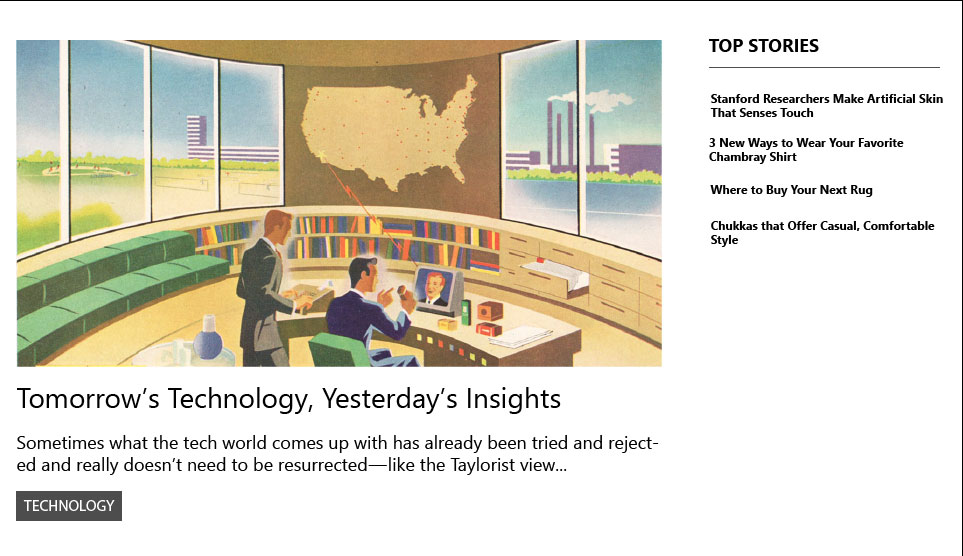
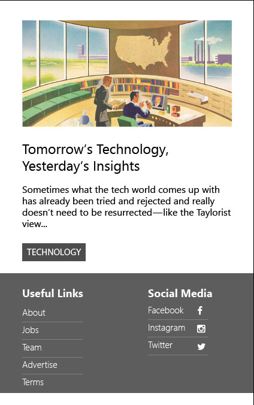



# Day 2 Classwork - Responsive Hero Page

  *Teach someone something new. And today you shall learn something new!*
  
## Guest Presenter of the Day!

 * Set aside five minutes of class to have a pre-planned student explain to the class a particular topic they are an expert in.
 * Remind the next class's presenter to prepare.

## Career Prep Action Item

Last night you were asked to develop a Code Schedule that would set you up for success in the coming weeks. Today you're going to swear fealty to it.

* Share your Code Schedules in RocketChat.
* Promise to your neighbor you will follow you Code Schedule.

## Daily Logic/Whiteboard Training

*Another river crossing puzzle goes as follows.*
**Three humans, one big monkey and two small monkeys are to cross a river:**

* Only humans and the big monkey can row the boat.
* At all times, the number of humans on either side of the river must be greater or equal to the number of monkeys on that side. (Or else the humans will be eaten by the monkeys!)
* The boat only has room for 2 (monkeys or humans).
* Monkeys can jump out of the boat when it's banked.

## Overview

Today you will redesign your personal landing page to be responsive for multiple views: mobile, tablet and desktop.

## Today's Checklist

<!-- This is for their personal navigation through the project. They can go through and make sure they get each thing and can comb over it later.  -->

1. Bring a piece of **paper** and **pencil** to class and begin drawing out the layout of boxes you see for your mobile design.
2. Repeat for the tablet view.
3. Code it.
4. Add, commit, push and copy/paste link to turn in.

## Responsive Landing Page

### Project Objective

<!-- In this section we tell the students what they will achieve by the end of the class. For us its a way to set up a goal and reverse engineer it.  -->
You are designing these views and then coding the two new looks. Make sure you follow the best practices you learned about last night to build some really cool sites you can show off to your friends.

### Example

<!-- A picture, mock-up or demo of what they will bring. Link to a website in the wild would be really cool! -->

* To get an idea of what you'll need to do, look at the flow of these three views of the same webpage.

#### Laptop/Desktop

#### Tablet

#### Phone

### Instructions

<!-- There should be clear step by step instruction so the material can be asynchronously consumed. This will significantly help our students learn, review and improve your teaching experience.  -->

1. Draw out the wireframe for both tablet and mobile views.
1. Use the **2nd method** of the Media Query methods you learned about to build your mobile view.
  * Remember to run `git status` and ensure your status is clean and on the `master` branch before you begin
1. Make a new css file called - mobile-style.css
  * Remember to link it
1. Drag your browser window to the size of a phone and test to see if you're getting the proper css rules to apply.
1. Code it.
1. Use the **2nd method** of the Media Query methods you learned about to build your tablet view.
1. Drag your browser window to the size of a tablet and test to see if you're getting the proper css rules to apply.
1. Code it.
1. Add, commit, push and copy/paste the repo's URL link in Campus Manager to turn it in.

<!-- ### Follow-up Video -->
<!-- This video will come from ACA. It should be a place that helps them understand the material on a deeper level.  -->
<!-- <iframe width="560" height="315" src="https://www.youtube.com/embed/XQu8TTBmGhA" frameborder="0" allow="autoplay; encrypted-media" allowfullscreen></iframe> -->

## Review and Further Practice

<!-- Link to a challenge to use the same skill but in a different project that doesn't have step-by-step instructions. This is for the more advanced students and for students to continue practicing btw, during and after sessions.  -->

1. Learn more about documentation by looking for new [CSS properties](https://developer.mozilla.org/en-US/docs/Web/CSS/CSS_Properties_Reference)
1. Apply new CSS properties to your project above.
1. Look ahead to figure out CSS Grid. Can you use it responsively?

## Interview Questions (BlogPost_102)

*Every class will end with a discussion over these questions. If you have no idea about them, ask your instructor. Nevertheless, you will need to research the topics on your own and record what you learned in a blog, then link the url of the published blog into Campus Manager.*

1. Describe one thing you learned in class today.
1. What's the difference between inline and inline-block?
1. How would you approach fixing browser-specific styling issues?
1. What are the different ways to visually hide content (and make it available only for screen readers)?
1. Describe BFC (Block Formatting Context) and how it works.

**¡Important!**

1. Remember, you will be graded for the completion of your blog, but also this will be a place you can return to when preparing for interviews in a few months!
1. **When publishing your blogs, make sure you "@AustinCodingAcademy", "@LubbockCodingAcademy", and tag "Coding", and "Web Development" in your story.**

## Go to [Week 3 Day 1 Pre-Homework >](../03Week/01DayPrep.md)

# Instructor Notes

1. create an assignment called: " mobile-LandingPage "
1. create an assignment called: " tablet-LandingPage "
1. create an assignment called: " BlogPost_102 "
1. remind students to look ahead and begin planning/thinking about checkpoint 1.


